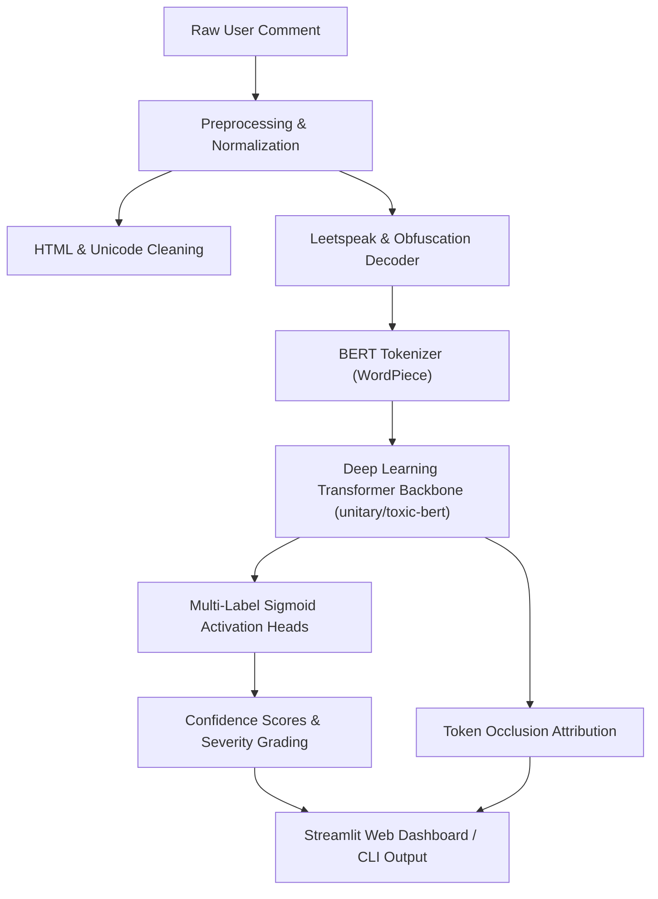

# 🛡️ Cyberbullying & Toxic Comment Detector

An end-to-end Deep Learning application that detects toxicity, cyberbullying, threats, insults, profanity, and hate speech in online comments, providing granular multi-label confidence scores and word-level explainability.

---

## 🌟 Key Features

- **Multi-Label Deep Learning Classification:** Evaluates comments across 6 distinct categories simultaneously with confidence probabilities:
  - ⚠️ **Toxicity** (general rude or abusive comments)
  - 🛑 **Severe Toxicity** (extremely hateful, aggressive, or destructive remarks)
  - 🤬 **Obscenity / Profanity** (vulgar, explicit language)
  - 🚨 **Threat / Violence** (statements expressing intent to harm or commit violence)
  - 🎯 **Insult / Harassment** (demeaning, disparaging, or belittling remarks)
  - 🛡️ **Identity Hate Speech** (attacks targeting race, religion, gender, sexual orientation, or identity)
- **Token-Level Explainability:** Pinpoints and highlights the specific trigger words in the comment that caused the elevated toxicity scores.
- **Obfuscation & Leetspeak Resilience:** Normalizes obfuscated toxic terms (e.g. `b!tch`, `f*ck`, `sh1t`, `l0ser`) that attackers use to bypass simple keyword filters.
- **Interactive Streamlit Web Dashboard:**
  - Real-time comment analysis with instant visual score meters and distribution charts.
  - One-click benchmark sample loader.
  - Adjustable sensitivity threshold slider.
  - Batch processing mode for testing lists of comments or CSV file uploads with downloadable results.
- **Command-Line Interface (CLI):** Fast command-line evaluation and interactive REPL mode.

---

## 🏗️ Architecture



---

## 🚀 Quick Start Guide

### 1. Prerequisites & Installation
Ensure you have Python 3.10+ installed. Clone the repository and install the dependencies:

```bash
git clone https://github.com/your-username/DL-cyberbullying-detector.git
cd "DL cyberbullying detector"
pip install -r requirements.txt
```

*(PyTorch CPU version can be installed directly via `pip install torch torchvision torchaudio --index-url https://download.pytorch.org/whl/cpu`)*

---

### 2. Launch the Streamlit Web Application

To launch the web dashboard:

```bash
streamlit run app.py
```

The app will open automatically in your browser at `http://localhost:8501`.

---

### 3. Using the Command-Line Interface (CLI)

#### Analyze a single comment:
```bash
python cli.py "I will find where you live and hurt you"
```

#### Run across standard benchmark samples:
```bash
python cli.py --samples
```

#### Interactive Terminal Prompt:
```bash
python cli.py
```

---

## 📊 Detection Categories & Severity Tiers

| Category | Description | Primary Indicator |
| :--- | :--- | :--- |
| **Clean (Safe)** | Non-toxic, polite, or constructive disagreement | All probabilities < 0.20 |
| **Toxicity** | Rude, unreasonable, or disrespectful discourse | High general toxicity head |
| **Severe Toxicity** | Intensely hostile or hateful commentary | Score > 0.70 |
| **Obscenity** | Profane language or vulgarity | High obscene head |
| **Threat** | Direct violence or bodily harm threats | Any threat score >= 0.50 |
| **Insult** | Name-calling or demeaning remarks | High insult head |
| **Identity Hate** | Slurs or attacks against protected demographic groups | High identity_hate head |

---

## 📂 Project Structure

```
DL cyberbullying detector/
├── app.py                  # Main Streamlit web application
├── cli.py                  # Interactive CLI interface
├── requirements.txt        # Python package dependencies
├── README.md               # Project documentation
├── src/
│   ├── __init__.py         # Package initializer
│   ├── model.py            # Deep Learning classifier & explainability pipeline
│   ├── preprocessor.py     # Text cleaning & leetspeak normalization
│   └── samples.py          # Benchmark sample comments for one-click testing
└── tests/
    └── test_detector.py    # Unit tests for preprocessing & tokenizer
```

---

## ⚖️ Ethics & Responsible AI Considerations
- Automated moderation tools should assist human moderators rather than act as sole arbiters in sensitive contexts.
- The adjustable sensitivity threshold helps organizations tailor detection to their community standards (e.g., stricter threshold for youth gaming platforms, more permissive for adult political debates).
